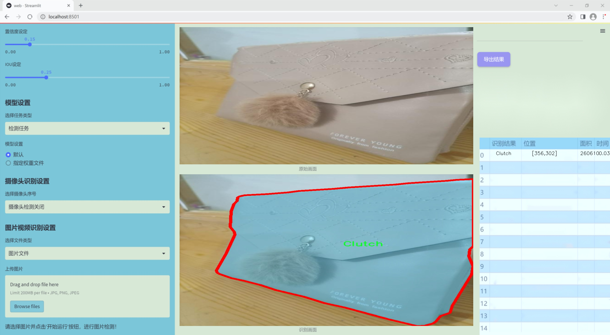
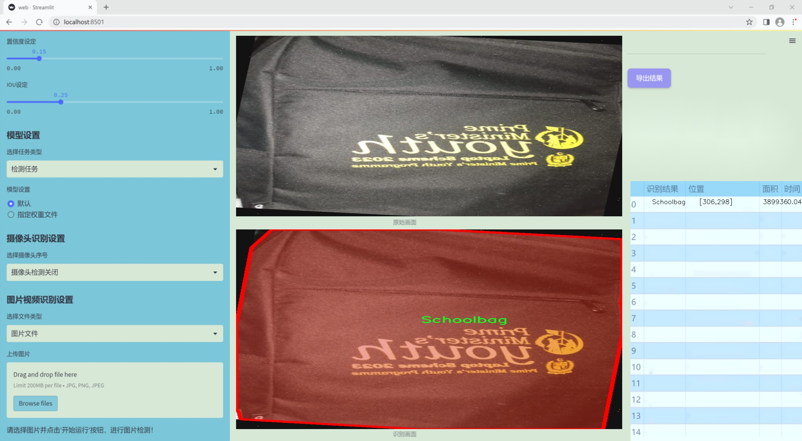
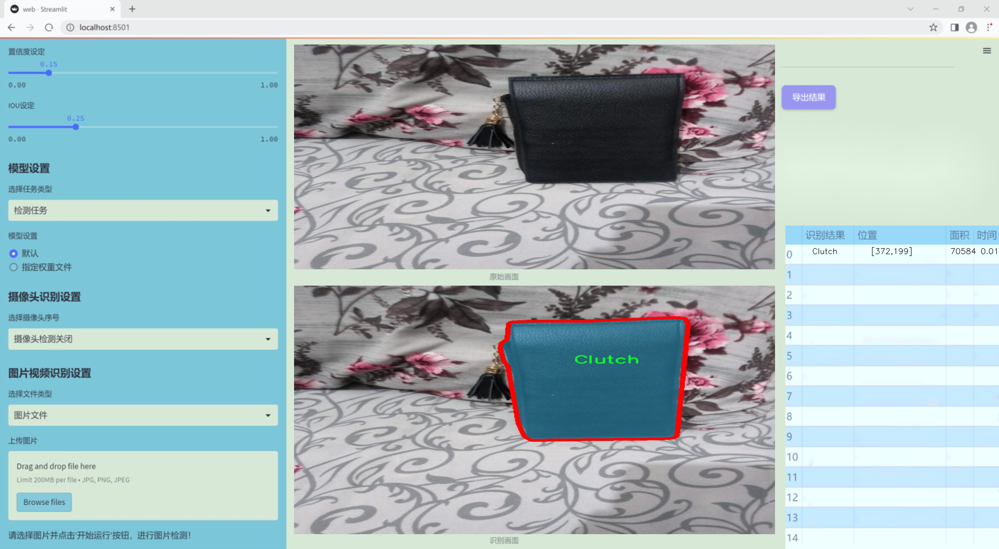
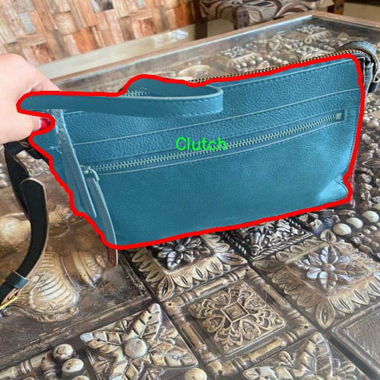
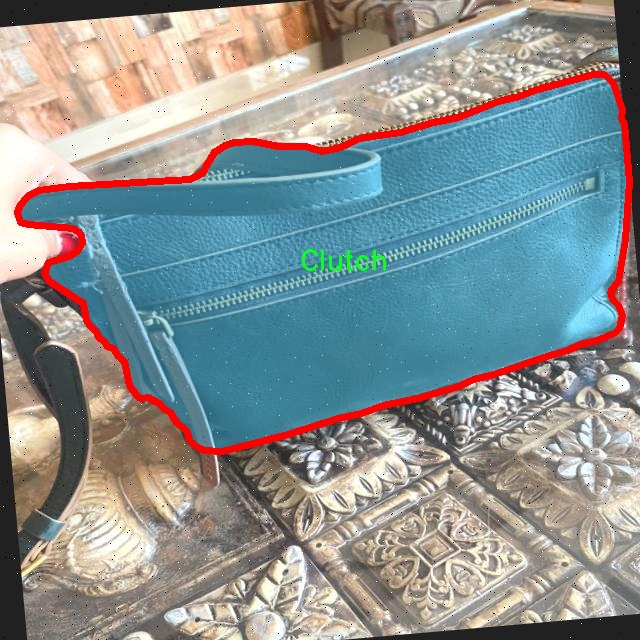
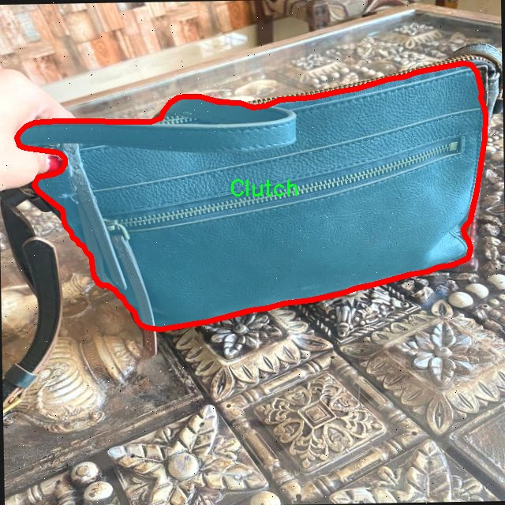
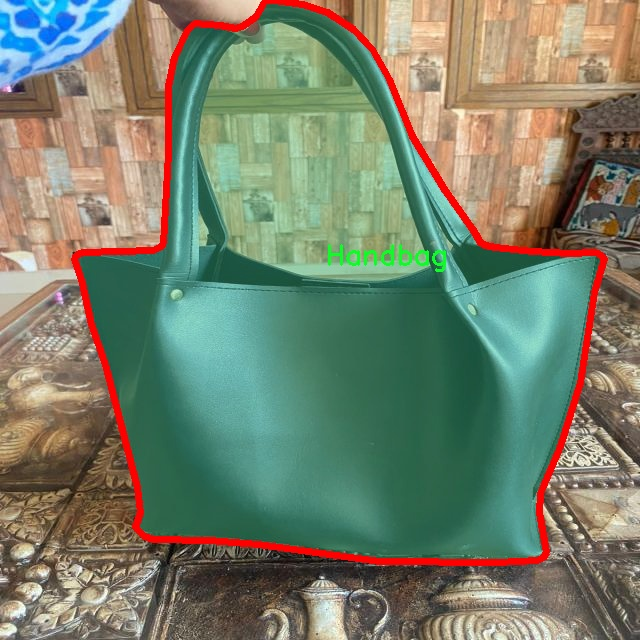
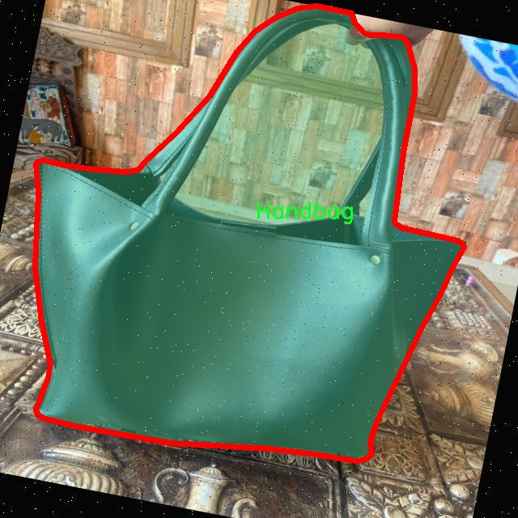

### 1.背景意义

研究背景与意义

随着人工智能技术的迅猛发展，计算机视觉在各个领域的应用日益广泛，尤其是在物体检测和识别方面。手袋作为一种常见的时尚配饰，其种类繁多，形态各异，传统的手动分类方法不仅耗时耗力，而且容易受到主观因素的影响。因此，开发一种高效、准确的手袋类型检测系统显得尤为重要。本研究旨在基于改进的YOLOv11模型，构建一个能够自动识别和分类手袋类型的系统，以提高手袋检测的效率和准确性。

本项目所使用的数据集包含4300张图像，涵盖了三种手袋类型：手拿包（Clutch）、手提包（Handbag）和书包（Schoolbag）。这些数据的多样性为模型的训练提供了丰富的样本，有助于提升模型的泛化能力。通过对这些图像进行实例分割处理，模型不仅能够识别手袋的种类，还能精确定位其在图像中的位置。这一技术的应用，将为时尚行业、电子商务平台及相关领域提供强有力的支持，帮助商家更好地管理库存、优化推荐系统，并提升用户体验。

此外，随着社交媒体和在线购物的普及，消费者对手袋的需求日益增加，市场竞争也愈发激烈。通过引入先进的计算机视觉技术，企业能够在激烈的市场环境中获得竞争优势。因此，基于改进YOLOv11的手袋类型检测系统不仅具有学术研究的价值，更具备广泛的商业应用前景。通过本研究的开展，期望能够推动手袋检测技术的发展，并为相关领域的研究提供新的思路和方法。

### 2.视频效果

[2.1 视频效果](https://www.bilibili.com/video/BV1zTqVYKEek/)

### 3.图片效果







##### [项目涉及的源码数据来源链接](https://kdocs.cn/l/cszuIiCKVNis)**

注意：本项目提供训练的数据集和训练教程,由于版本持续更新,暂不提供权重文件（best.pt）,请按照6.训练教程进行训练后实现上图演示的效果。

### 4.数据集信息

##### 4.1 本项目数据集类别数＆类别名

nc: 3
names: ['Clutch', 'Handbag', 'Schoolbag']


该项目为【图像分割】数据集，请在【训练教程和Web端加载模型教程（第三步）】这一步的时候按照【图像分割】部分的教程来训练

##### 4.2 本项目数据集信息介绍

本项目数据集信息介绍

本项目所使用的数据集旨在支持改进YOLOv11的手袋类型检测系统，主题为“Bag's Detection New”。该数据集包含三种主要类别，分别为Clutch（手拿包）、Handbag（手提包）和Schoolbag（书包），总类别数量为三。这些类别的选择不仅反映了日常生活中常见的手袋类型，还涵盖了不同场合和功能的需求，使得模型能够在多样化的场景中进行有效的识别与分类。

数据集的构建过程中，特别注重了样本的多样性和代表性。每一类手袋都包含了不同品牌、颜色、材质和设计风格的样本，以确保模型在训练过程中能够学习到丰富的特征。这种多样性有助于提高模型的泛化能力，使其在实际应用中能够更好地适应不同的手袋类型和外观变化。此外，数据集中的图像经过精心标注，确保每个样本的目标区域清晰可辨，便于模型进行准确的目标检测。

在数据集的收集过程中，考虑到了现实生活中的使用场景，图像来源于多种环境，包括街头、商场、室内和户外等。这种多样化的环境设置不仅增强了数据集的实用性，也为模型在不同光照和背景条件下的表现提供了良好的训练基础。通过对该数据集的训练，期望能够显著提升YOLOv11在手袋类型检测任务中的准确性和效率，从而推动相关领域的研究与应用发展。











### 5.全套项目环境部署视频教程（零基础手把手教学）

[5.1 所需软件PyCharm和Anaconda安装教程（第一步）](https://www.bilibili.com/video/BV1BoC1YCEKi/?spm_id_from=333.999.0.0&vd_source=bc9aec86d164b67a7004b996143742dc)


[5.2 安装Python虚拟环境创建和依赖库安装视频教程（第二步）](https://www.bilibili.com/video/BV1ZoC1YCEBw?spm_id_from=333.788.videopod.sections&vd_source=bc9aec86d164b67a7004b996143742dc)

### 6.改进YOLOv11训练教程和Web_UI前端加载模型教程（零基础手把手教学）

[6.1 改进YOLOv11训练教程和Web_UI前端加载模型教程（第三步）](https://www.bilibili.com/video/BV1BoC1YCEhR?spm_id_from=333.788.videopod.sections&vd_source=bc9aec86d164b67a7004b996143742dc)


按照上面的训练视频教程链接加载项目提供的数据集，运行train.py即可开始训练



     Epoch   gpu_mem       box       obj       cls    labels  img_size
     1/200     20.8G   0.01576   0.01955  0.007536        22      1280: 100%|██████████| 849/849 [14:42<00:00,  1.04s/it]
               Class     Images     Labels          P          R     mAP@.5 mAP@.5:.95: 100%|██████████| 213/213 [01:14<00:00,  2.87it/s]
                 all       3395      17314      0.994      0.957      0.0957      0.0843

     Epoch   gpu_mem       box       obj       cls    labels  img_size
     2/200     20.8G   0.01578   0.01923  0.007006        22      1280: 100%|██████████| 849/849 [14:44<00:00,  1.04s/it]
               Class     Images     Labels          P          R     mAP@.5 mAP@.5:.95: 100%|██████████| 213/213 [01:12<00:00,  2.95it/s]
                 all       3395      17314      0.996      0.956      0.0957      0.0845

     Epoch   gpu_mem       box       obj       cls    labels  img_size
     3/200     20.8G   0.01561    0.0191  0.006895        27      1280: 100%|██████████| 849/849 [10:56<00:00,  1.29it/s]
               Class     Images     Labels          P          R     mAP@.5 mAP@.5:.95: 100%|███████   | 187/213 [00:52<00:00,  4.04it/s]
                 all       3395      17314      0.996      0.957      0.0957      0.0845


###### [项目数据集下载链接](https://kdocs.cn/l/cszuIiCKVNis)

### 7.原始YOLOv11算法讲解


YOLO11 是 Ultralytics YOLO 系列的最新版本，结合了尖端的准确性、速度和效率，用于目标检测、分割、分类、定向边界框和姿态估计。与
YOLOv8 相比，它具有更少的参数和更好的结果，不难预见，YOLO11 在边缘设备上更高效、更快，将频繁出现在计算机视觉领域的最先进技术（SOTA）中。


**主要特点**

  * **增强的特征提取：**YOLO11 使用改进的主干和颈部架构来增强特征提取，以实现更精确的目标检测和复杂任务的性能。

  * **针对效率和速度优化：**精细的架构设计和优化的训练流程在保持准确性和性能之间最佳平衡的同时，提供更快的处理速度。

  * **更少的参数，更高的准确度：**YOLO11m 在 COCO 数据集上实现了比 YOLOv8m 更高的 mAP，参数减少了 22%，提高了计算效率，同时不牺牲准确度。

  * **跨环境的适应性：**YOLO11 可以无缝部署在边缘设备、云平台和配备 NVIDIA GPU 的系统上，确保最大的灵活性。

  * **支持广泛的任务范围：**YOLO11 支持各种计算机视觉任务，如目标检测、实例分割、图像分类、姿态估计和定向目标检测（OBB）。


### 8.200+种全套改进YOLOV11创新点原理讲解

#### 8.1 200+种全套改进YOLOV11创新点原理讲解大全

由于篇幅限制，每个创新点的具体原理讲解就不全部展开，具体见下列网址中的改进模块对应项目的技术原理博客网址【Blog】（创新点均为模块化搭建，原理适配YOLOv5~YOLOv11等各种版本）

[改进模块技术原理博客【Blog】网址链接](https://gitee.com/qunmasj/good)


#### 8.2 精选部分改进YOLOV11创新点原理讲解

###### 这里节选部分改进创新点展开原理讲解(完整的改进原理见上图和[改进模块技术原理博客链接](https://gitee.com/qunmasj/good)【如果此小节的图加载失败可以通过CSDN或者Github搜索该博客的标题访问原始博客，原始博客图片显示正常】
### 可变性卷积DCN简介
卷积神经网络由于其构建模块中固定的几何结构，本质上受限于模型几何变换。为了提高卷积神经网络的转换建模能力，《Deformable Convolutional Networks》作者提出了两个模块：可变形卷积（deformable convolution）和可变形RoI池（deformable RoI pooling）。这两个模块均基于用额外的偏移来增加模块中的空间采样位置以及从目标任务中学习偏移的思想，而不需要额外的监督。

第一次证明了在深度神经网络中学习密集空间变换（dense spatial transformation）对于复杂的视觉任务是有效的

视觉识别中的一个关键挑战是如何适应对象比例、姿态、视点和零件变形中的几何变化或模型几何变换。一般有两种方法实现：
1）建立具有足够期望变化的训练数据集。这通常通过增加现有的数据样本来实现，例如通过仿射变换。但是训练成本昂贵而且模型参数庞大。
2）使用变换不变（transformation-invariant）的特征和算法。比如比较有名的SIFT(尺度不变特征变换)便是这一类的代表算法。

但以上的方法有两个缺点：
1）几何变换被假定为固定的和已知的，这些先验知识被用来扩充数据，设计特征和算法。为此，这个假设阻止了对具有未知几何变换的新任务的推广，从而导致这些几何变换可能没有被正确建模。
2）对于不变特征和算法进行手动设计，对于过于复杂的变换可能是困难的或不可行的。

卷积神经网络本质上局限于模拟大型未知转换。局限性源于CNN模块的固定几何结构：卷积单元在固定位置对输入特征图进行采样；池化层以固定比率降低特征矩阵分辨率；RoI（感兴趣区域）池化层将RoI分成固定的空间箱（spatial bins）等。缺乏处理几何变换的内部机制。

这种内部机制的缺乏会导致一些问题，举个例子。同一个CNN层中所有激活单元的感受野大小是相同的，但是这是不可取的。因为不同的位置可能对应于具有不同尺度或变形的对象，所以尺度或感受野大小的自适应确定对于具有精细定位的视觉识别是渴望的。

对于这些问题，作者提出了两个模块提高CNNs对几何变换建模的能力。


deformable convolution（可变形卷积）
将2D偏移量添加到标准卷积中的常规网格采样位置，使得采样网格能够自由变形。通过额外的卷积层，从前面的特征映射中学习偏移。因此，变形采用局部、密集和自适应的方式取决于输入特征。


deformable RoI pooling（可变形RoI池化）
为先前RoI池化的常规库（bin）分区中的每个库位置（bin partition）增加了一个偏移量。类似地，偏移是从前面的特征图和感兴趣区域中学习的，从而能够对具有不同形状的对象进行自适应部件定位（adaptive part localization）。

#### Deformable Convolutional Networks
Deformable Convolution
2D卷积由两个步骤组成：
1）在输入特征图x xx上使用规则网格R RR进行采样。
2）把这些采样点乘不同权重w ww后相加。

网格R定义感受野大小和扩张程度，比如内核大小为3x3，扩张程度为1的网格R可以表示为：
R = { ( − 1 , − 1 ) , ( − 1 , 0 ) , … , ( 0 , 1 ) , ( 1 , 1 ) } R = \{(-1,-1),(-1,0),\dots,(0,1),(1,1)\}
R={(−1,−1),(−1,0),…,(0,1),(1,1)}

​
 一般为小数，使用双线性插值进行处理。（把小数坐标分解到相邻的四个整数坐标点来计算结果）


具体操作如图所示：


首先对输入特征层进行一个普通的3x3卷积处理得到偏移域（offset field）。偏移域特征图具有与输入特征图相同的空间分辨率，channels维度2N对应于N个2D（xy两个方向）偏移。其中的N是原输入特征图上所具有的N个channels，也就是输入输出channels保持不变，这里xy两个channels分别对输出特征图上的一个channels进行偏移。确定采样点后就通过与相对应的权重w点乘相加得到输出特征图上该点最终值。

前面也提到过，由于这里xy两个方向所训练出来的偏移量一般来说是一个小数，那么为了得到这个点所对应的数值，会采用双线性插值的方法，从最近的四个邻近坐标点中计算得到该偏移点的数值，公式如下：


具体推理过程见：双线性插值原理

#### Deformable RoI Poolingb
所有基于区域提议（RPN）的对象检测方法都使用RoI池话处理，将任意大小的输入矩形区域转换为固定大小的特征图。


 一般为小数，需要使用双线性插值进行处理。


具体操作如图所示：


当时看这个部分的时候觉得有些突兀，明明RoI池化会将特征层转化为固定尺寸的区域。其实，我个人觉得，这个部分与上述的可变性卷积操作是类似的。这里同样是使用了一个普通的RoI池化操作，进行一些列处理后得到了一个偏移域特征图，然后重新作用于原来的w × H w \times Hw×H的RoI。只不过这里不再是规律的逐行逐列对每个格子进行池化，而是对于格子进行偏移后再池化处理。

#### Postion﹣Sensitive RoI Pooling
除此之外，论文还提出一种PS RoI池化（Postion﹣Sensitive RoI Pooling）。不同于上述可变形RoI池化中的全连接过程，这里使用全卷积替换。

具体操作如图所示：


首先，对于原来的特征图来说，原本是将输入特征图上的RoI区域分成k × k k\times kk×k个bin。而在这里，则是将输入特征图进行卷积操作，分别得到一个channels为k 2 ( C + 1 ) k^{2}(C+1)k (C+1)的得分图（score maps）和一个channels为2 k 2 ( C + 1 ) 2k{2}(C+1)2k 2 (C+1)的偏移域（offset fields），这两个特征矩阵的宽高是与输入特征矩阵相同的。其中，得分图的channels中，k × k k \times kk×k分别表示的是每一个网格，C CC表示的检测对象的类别数目，1表示背景。而在偏移域中的2表示xy两个方向的偏移。
也就是说，在PS RoI池化中，对于RoI的每一个网格都独自占一个通道形成一层得分图，然后其对于的偏移量占两个通道。offset fields得到的偏移是归一化后的偏移，需要通过和deformable RoI pooling中一样的变换方式得到∆ p i j ∆p_{ij}∆p ij，然后对每层得分图进行偏移池化处理。最后处理完的结果就对应着最后输出的一个网格。所以其包含了位置信息。

原文论述为：


#### Understanding Deformable ConvNets
当可变形卷积叠加时，复合变形的效果是深远的。如图所示：


ps：a是标准卷积的固定感受野，b是可变形卷积的适应性感受野。

感受野和标准卷积中的采样位置在整个顶部特征图上是固定的(左)。在可变形卷积中，它们根据对象的比例和形状进行自适应调整(右)。


### 9.系统功能展示

图9.1.系统支持检测结果表格显示

  图9.2.系统支持置信度和IOU阈值手动调节

  图9.3.系统支持自定义加载权重文件best.pt(需要你通过步骤5中训练获得)

  图9.4.系统支持摄像头实时识别

  图9.5.系统支持图片识别

  图9.6.系统支持视频识别

  图9.7.系统支持识别结果文件自动保存

  图9.8.系统支持Excel导出检测结果数据


### 10. YOLOv11核心改进源码讲解

#### 10.1 dyhead_prune.py

以下是经过精简和注释的核心代码部分，主要保留了关键的模块和函数，并对其进行了详细的中文注释：

```python
import torch
import torch.nn as nn
import torch.nn.functional as F

# 定义一个函数，用于确保某个值是可被指定的除数整除的
def _make_divisible(v, divisor, min_value=None):
    if min_value is None:
        min_value = divisor
    new_v = max(min_value, int(v + divisor / 2) // divisor * divisor)
    # 确保向下取整不会减少超过10%
    if new_v < 0.9 * v:
        new_v += divisor
    return new_v

# Swish 激活函数
class swish(nn.Module):
    def forward(self, x):
        return x * torch.sigmoid(x)

# h-Swish 激活函数
class h_swish(nn.Module):
    def __init__(self, inplace=False):
        super(h_swish, self).__init__()
        self.inplace = inplace

    def forward(self, x):
        return x * F.relu6(x + 3.0, inplace=self.inplace) / 6.0

# h-Sigmoid 激活函数
class h_sigmoid(nn.Module):
    def __init__(self, inplace=True, h_max=1):
        super(h_sigmoid, self).__init__()
        self.relu = nn.ReLU6(inplace=inplace)
        self.h_max = h_max

    def forward(self, x):
        return self.relu(x + 3) * self.h_max / 6

# 动态 ReLU 激活函数
class DyReLU(nn.Module):
    def __init__(self, inp, reduction=4, lambda_a=1.0, K2=True, use_bias=True, use_spatial=False,
                 init_a=[1.0, 0.0], init_b=[0.0, 0.0]):
        super(DyReLU, self).__init__()
        self.oup = inp  # 输出通道数
        self.lambda_a = lambda_a * 2  # 动态参数
        self.K2 = K2
        self.avg_pool = nn.AdaptiveAvgPool2d(1)  # 自适应平均池化

        # 确定 squeeze 通道数
        squeeze = _make_divisible(inp // reduction, 4)
        
        # 定义全连接层
        self.fc = nn.Sequential(
            nn.Linear(inp, squeeze),
            nn.ReLU(inplace=True),
            nn.Linear(squeeze, self.oup * (4 if K2 else 2)),
            h_sigmoid()
        )
        self.spa = nn.Sequential(
            nn.Conv2d(inp, 1, kernel_size=1),
            nn.BatchNorm2d(1),
        ) if use_spatial else None

    def forward(self, x):
        b, c, h, w = x.size()  # 获取输入的维度
        y = self.avg_pool(x).view(b, c)  # 平均池化
        y = self.fc(y).view(b, self.oup * (4 if self.K2 else 2), 1, 1)  # 通过全连接层
        
        # 计算输出
        out = ...  # 省略具体实现细节
        return out

# 动态可变形卷积层
class DyDCNv2(nn.Module):
    def __init__(self, in_channels, out_channels, stride=1, norm_cfg=dict(type='GN', num_groups=16, requires_grad=True)):
        super().__init__()
        self.conv = ModulatedDeformConv2d(in_channels, out_channels, 3, stride=stride, padding=1)
        self.norm = build_norm_layer(norm_cfg, out_channels)[1] if norm_cfg else None

    def forward(self, x, offset, mask):
        x = self.conv(x.contiguous(), offset, mask)  # 应用可变形卷积
        if self.norm:
            x = self.norm(x)  # 应用归一化
        return x

# DyHead Block
class DyHeadBlock_Prune(nn.Module):
    def __init__(self, in_channels, norm_type='GN', zero_init_offset=True, act_cfg=dict(type='HSigmoid')):
        super().__init__()
        self.spatial_conv_high = DyDCNv2(in_channels, in_channels)
        self.spatial_conv_mid = DyDCNv2(in_channels, in_channels)
        self.spatial_conv_low = DyDCNv2(in_channels, in_channels, stride=2)
        self.spatial_conv_offset = nn.Conv2d(in_channels, 27, 3, padding=1)  # 3 * 3 * 3
        self.scale_attn_module = nn.Sequential(
            nn.AdaptiveAvgPool2d(1), nn.Conv2d(in_channels, 1, 1),
            nn.ReLU(inplace=True), build_activation_layer(act_cfg)
        )
        self.task_attn_module = DyReLU(in_channels)

    def forward(self, x, level):
        offset_and_mask = self.spatial_conv_offset(x[level])  # 计算偏移和掩码
        mid_feat = self.spatial_conv_mid(x[level], offset, mask)  # 中间特征
        sum_feat = mid_feat * self.scale_attn_module(mid_feat)  # 加权特征
        return self.task_attn_module(sum_feat)  # 返回任务注意力模块的输出
```

### 代码分析
1. **激活函数**: 代码中定义了多种激活函数，包括 Swish、h-Swish 和 h-Sigmoid，这些函数在深度学习中常用于引入非线性。
2. **动态 ReLU**: `DyReLU` 类实现了一种动态的激活函数，可以根据输入特征自适应调整其参数。
3. **动态可变形卷积**: `DyDCNv2` 类实现了可变形卷积，能够根据输入特征的偏移和掩码进行动态卷积操作。
4. **DyHead Block**: `DyHeadBlock_Prune` 类整合了多个卷积层和注意力机制，能够根据不同层次的特征进行动态调整和加权。

以上是代码的核心部分和详细注释，旨在帮助理解其功能和结构。

这个文件 `dyhead_prune.py` 是一个实现深度学习模型中动态头部（Dynamic Head）模块的代码，主要用于计算机视觉任务中的特征提取和注意力机制。代码使用了 PyTorch 框架，并且引入了一些其他库（如 mmcv 和 mmengine）来构建激活层和归一化层。

首先，文件中定义了一个 `_make_divisible` 函数，用于确保某个值能够被指定的除数整除，并且在必要时进行调整，以避免因四舍五入导致的显著减少。

接下来，定义了几个激活函数的类，包括 `swish`、`h_swish` 和 `h_sigmoid`。这些类都是继承自 `nn.Module`，并实现了 `forward` 方法，以便在前向传播中使用这些激活函数。

`DyReLU` 类是一个动态激活函数模块，它的设计允许根据输入特征的不同动态调整激活值。它包含多个参数，允许用户自定义激活的行为，比如是否使用偏置、是否使用空间注意力等。其核心是通过全连接层和一些数学运算来计算输出。

`DyDCNv2` 类是一个实现了可调变形卷积（Modulated Deformable Convolution）的模块，结合了归一化层。这个模块的输入和输出通道数可以灵活设置，并且支持不同的归一化配置。

`DyHeadBlock_Prune` 类是整个文件的核心部分，代表了一个包含三种类型注意力机制的动态头部块。它在初始化时设置了偏置、归一化类型等参数，并定义了多个卷积层用于特征提取。该类还包含一个 `_init_weights` 方法，用于初始化卷积层的权重。

在 `forward` 方法中，首先计算偏移量和掩码，然后通过不同的卷积层提取中间特征，并结合尺度注意力模块和任务注意力模块进行特征融合。最终，返回经过处理的特征图。

总体来说，这个文件实现了一个复杂的动态头部模块，利用了多种卷积和激活机制，旨在提高模型在视觉任务中的表现。

#### 10.2 kernel_warehouse.py

以下是代码中最核心的部分，并附上详细的中文注释：

```python
import torch
import torch.nn as nn
import torch.nn.functional as F

class Attention(nn.Module):
    def __init__(self, in_planes, reduction, num_static_cell, num_local_mixture, norm_layer=nn.BatchNorm1d,
                 cell_num_ratio=1.0, nonlocal_basis_ratio=1.0, start_cell_idx=None):
        super(Attention, self).__init__()
        # 计算隐藏层的通道数
        hidden_planes = max(int(in_planes * reduction), 16)
        self.kw_planes_per_mixture = num_static_cell + 1  # 每个混合的通道数
        self.num_local_mixture = num_local_mixture  # 本地混合数
        self.kw_planes = self.kw_planes_per_mixture * num_local_mixture  # 总通道数

        # 计算本地和非本地单元的数量
        self.num_local_cell = int(cell_num_ratio * num_local_mixture)
        self.num_nonlocal_cell = num_static_cell - self.num_local_cell
        self.start_cell_idx = start_cell_idx

        # 定义网络层
        self.avgpool = nn.AdaptiveAvgPool1d(1)  # 自适应平均池化
        self.fc1 = nn.Linear(in_planes, hidden_planes, bias=(norm_layer is not nn.BatchNorm1d))  # 全连接层
        self.norm1 = norm_layer(hidden_planes)  # 归一化层
        self.act1 = nn.ReLU(inplace=True)  # 激活函数

        # 根据非本地基数比率选择不同的映射方式
        if nonlocal_basis_ratio >= 1.0:
            self.map_to_cell = nn.Identity()  # 直接映射
            self.fc2 = nn.Linear(hidden_planes, self.kw_planes, bias=True)  # 第二个全连接层
        else:
            self.map_to_cell = self.map_to_cell_basis  # 使用基于单元的映射
            self.num_basis = max(int(self.num_nonlocal_cell * nonlocal_basis_ratio), 16)  # 基数数量
            self.fc2 = nn.Linear(hidden_planes, (self.num_local_cell + self.num_basis + 1) * num_local_mixture, bias=False)
            self.fc3 = nn.Linear(self.num_basis, self.num_nonlocal_cell, bias=False)  # 另一个全连接层
            self.basis_bias = nn.Parameter(torch.zeros([self.kw_planes]), requires_grad=True).float()  # 基数偏置

        self.temp_bias = torch.zeros([self.kw_planes], requires_grad=False).float()  # 温度偏置
        self.temp_value = 0  # 温度值
        self._initialize_weights()  # 初始化权重

    def _initialize_weights(self):
        # 权重初始化
        for m in self.modules():
            if isinstance(m, nn.Linear):
                nn.init.kaiming_normal_(m.weight, mode='fan_out', nonlinearity='relu')  # Kaiming初始化
                if m.bias is not None:
                    nn.init.constant_(m.bias, 0)  # 偏置初始化为0
            if isinstance(m, nn.BatchNorm1d):
                nn.init.constant_(m.weight, 1)  # 归一化权重初始化为1
                nn.init.constant_(m.bias, 0)  # 归一化偏置初始化为0

    def forward(self, x):
        # 前向传播
        x = self.avgpool(x.reshape(*x.shape[:2], -1)).squeeze(dim=-1)  # 池化操作
        x = self.act1(self.norm1(self.fc1(x)))  # 线性变换 + 归一化 + 激活
        x = self.map_to_cell(self.fc2(x)).reshape(-1, self.kw_planes)  # 映射到单元
        x = x / (torch.sum(torch.abs(x), dim=1).view(-1, 1) + 1e-3)  # 归一化
        x = (1.0 - self.temp_value) * x.reshape(-1, self.kw_planes) + self.temp_value * self.temp_bias.to(x.device).view(1, -1)  # 温度调整
        return x.reshape(-1, self.kw_planes_per_mixture)[:, :-1]  # 返回结果

class KWconvNd(nn.Module):
    def __init__(self, in_planes, out_planes, kernel_size, stride=1, padding=0, dilation=1, groups=1,
                 bias=False, warehouse_id=None, warehouse_manager=None):
        super(KWconvNd, self).__init__()
        self.in_planes = in_planes  # 输入通道数
        self.out_planes = out_planes  # 输出通道数
        self.kernel_size = kernel_size  # 卷积核大小
        self.stride = stride  # 步幅
        self.padding = padding  # 填充
        self.dilation = dilation  # 膨胀
        self.groups = groups  # 分组卷积
        self.bias = nn.Parameter(torch.zeros([self.out_planes]), requires_grad=True).float() if bias else None  # 偏置参数
        self.warehouse_id = warehouse_id  # 仓库ID
        self.warehouse_manager = [warehouse_manager]  # 仓库管理器

    def forward(self, x):
        # 前向传播
        kw_attention = self.attention(x).type(x.dtype)  # 获取注意力权重
        batch_size = x.shape[0]  # 批次大小
        x = x.reshape(1, -1, *x.shape[2:])  # 重塑输入
        weight = self.warehouse_manager[0].take_cell(self.warehouse_id).reshape(self.cell_shape[0], -1).type(x.dtype)  # 获取权重
        aggregate_weight = torch.mm(kw_attention, weight)  # 权重聚合
        output = self.func_conv(x, weight=aggregate_weight, bias=None, stride=self.stride, padding=self.padding,
                                dilation=self.dilation, groups=self.groups * batch_size)  # 卷积操作
        output = output.view(batch_size, self.out_planes, *output.shape[2:])  # 重塑输出
        if self.bias is not None:
            output = output + self.bias.reshape(1, -1, *([1]*self.dimension))  # 添加偏置
        return output  # 返回输出
```

### 代码说明：
1. **Attention类**：实现了一个注意力机制，用于计算输入特征的加权表示。它包含了多层全连接层、归一化层和激活函数，并根据输入的参数初始化权重。

2. **KWconvNd类**：是一个自定义的卷积层，支持多维卷积操作。它可以根据输入的参数配置卷积的各种属性，如输入输出通道、卷积核大小、步幅等。

3. **前向传播**：在`forward`方法中，注意力权重被计算并应用于输入特征，最后通过卷积操作生成输出。

这些类的组合使得模型能够在处理特征时动态地调整权重，增强了模型的表达能力。

这个程序文件 `kernel_warehouse.py` 是一个用于实现深度学习模型中卷积操作的模块，特别是通过一个称为“内核仓库”（Kernel Warehouse）的机制来管理卷积核的使用。程序主要包括几个类和函数，下面是对其功能和结构的详细说明。

首先，文件导入了一些必要的库，包括 PyTorch 的核心模块和一些数学函数。接着，定义了一个工具函数 `parse`，用于解析输入参数并返回适当的列表，确保输入的长度符合要求。

接下来，定义了一个 `Attention` 类，这个类实现了注意力机制。它的构造函数接受多个参数，包括输入通道数、减少比率、静态单元数量等。这个类的主要功能是通过全连接层和激活函数对输入进行处理，并生成注意力权重。它还包括温度更新和初始化的功能，这对于后续的模型训练是非常重要的。

`KWconvNd` 类是一个基于 `nn.Module` 的卷积层的基类，负责处理多维卷积操作。它的构造函数接受多个参数，如输入和输出通道数、卷积核大小、步幅、填充等，并根据这些参数初始化相应的属性。这个类还包含一个 `init_attention` 方法，用于初始化注意力机制。

然后，定义了 `KWConv1d`、`KWConv2d` 和 `KWConv3d` 类，分别用于一维、二维和三维卷积操作。这些类继承自 `KWconvNd`，并设置了相应的维度和卷积函数。

`KWLinear` 类是一个线性层的实现，使用了一维卷积来模拟线性变换。

`Warehouse_Manager` 类是整个内核仓库的管理器，负责创建和管理卷积层的内核。它的构造函数接受多个参数，包括减少比率、单元数量比率、共享范围等。这个类提供了 `reserve` 方法，用于记录卷积层的信息，并动态创建卷积层而不分配权重。`store` 方法用于存储卷积层的权重，而 `allocate` 方法则用于将权重分配给网络中的卷积层。

最后，`KWConv` 类是一个高层次的卷积层实现，它结合了内核仓库管理器和卷积操作，并添加了批归一化和激活函数的支持。

文件的最后定义了一个 `get_temperature` 函数，用于根据当前的训练迭代和周期计算温度值，这在训练过程中可能用于调整模型的行为。

整体来看，这个程序文件实现了一个灵活且高效的卷积操作机制，通过内核仓库的管理，可以在不同的卷积层之间共享和复用卷积核，从而减少参数数量，提高模型的效率。

#### 10.3 rmt.py

以下是经过简化并添加详细中文注释的核心代码部分：

```python
import torch
import torch.nn as nn
import torch.nn.functional as F

class DWConv2d(nn.Module):
    """ 深度可分离卷积类 """
    
    def __init__(self, dim, kernel_size, stride, padding):
        super().__init__()
        # 使用深度可分离卷积，groups=dim表示每个输入通道都有独立的卷积核
        self.conv = nn.Conv2d(dim, dim, kernel_size, stride, padding, groups=dim)

    def forward(self, x: torch.Tensor):
        '''
        x: 输入张量，形状为 (b, h, w, c)
        '''
        x = x.permute(0, 3, 1, 2)  # 转换为 (b, c, h, w)
        x = self.conv(x)  # 进行卷积操作
        x = x.permute(0, 2, 3, 1)  # 转换回 (b, h, w, c)
        return x

class MaSA(nn.Module):
    """ 多头自注意力机制类 """
    
    def __init__(self, embed_dim, num_heads, value_factor=1):
        super().__init__()
        self.factor = value_factor
        self.embed_dim = embed_dim
        self.num_heads = num_heads
        self.head_dim = self.embed_dim * self.factor // num_heads  # 每个头的维度
        self.key_dim = self.embed_dim // num_heads  # 键的维度
        self.scaling = self.key_dim ** -0.5  # 缩放因子
        # 定义线性变换层
        self.q_proj = nn.Linear(embed_dim, embed_dim, bias=True)
        self.k_proj = nn.Linear(embed_dim, embed_dim, bias=True)
        self.v_proj = nn.Linear(embed_dim, embed_dim * self.factor, bias=True)
        self.out_proj = nn.Linear(embed_dim * self.factor, embed_dim, bias=True)
        self.reset_parameters()  # 初始化参数

    def reset_parameters(self):
        # 使用Xavier初始化权重
        nn.init.xavier_normal_(self.q_proj.weight)
        nn.init.xavier_normal_(self.k_proj.weight)
        nn.init.xavier_normal_(self.v_proj.weight)
        nn.init.xavier_normal_(self.out_proj.weight)

    def forward(self, x: torch.Tensor, rel_pos):
        '''
        x: 输入张量，形状为 (b, h, w, c)
        rel_pos: 位置关系张量
        '''
        bsz, h, w, _ = x.size()  # 获取输入的批次大小、高度和宽度

        # 线性变换得到查询、键、值
        q = self.q_proj(x)
        k = self.k_proj(x)
        v = self.v_proj(x)

        # 进行缩放
        k *= self.scaling

        # 计算注意力权重
        qk_mat = q @ k.transpose(-1, -2) + rel_pos  # 添加相对位置编码
        qk_mat = torch.softmax(qk_mat, dim=-1)  # 归一化为概率分布

        # 计算输出
        output = torch.matmul(qk_mat, v)  # 加权求和
        output = self.out_proj(output)  # 最后的线性变换
        return output

class FeedForwardNetwork(nn.Module):
    """ 前馈神经网络类 """
    
    def __init__(self, embed_dim, ffn_dim, activation_fn=F.gelu, dropout=0.0):
        super().__init__()
        self.fc1 = nn.Linear(embed_dim, ffn_dim)  # 第一层线性变换
        self.fc2 = nn.Linear(ffn_dim, embed_dim)  # 第二层线性变换
        self.dropout = nn.Dropout(dropout)  # dropout层
        self.activation_fn = activation_fn  # 激活函数

    def forward(self, x: torch.Tensor):
        '''
        x: 输入张量，形状为 (b, h, w, c)
        '''
        x = self.fc1(x)  # 第一层线性变换
        x = self.activation_fn(x)  # 激活函数
        x = self.dropout(x)  # dropout
        x = self.fc2(x)  # 第二层线性变换
        return x

class VisRetNet(nn.Module):
    """ 视觉回归网络类 """
    
    def __init__(self, in_chans=3, num_classes=1000, embed_dims=[96, 192, 384, 768], depths=[2, 2, 6, 2], num_heads=[3, 6, 12, 24]):
        super().__init__()
        self.patch_embed = PatchEmbed(in_chans=in_chans, embed_dim=embed_dims[0])  # 图像分块嵌入
        self.layers = nn.ModuleList()  # 存储各层

        # 构建各层
        for i_layer in range(len(depths)):
            layer = BasicLayer(embed_dim=embed_dims[i_layer], depth=depths[i_layer], num_heads=num_heads[i_layer])
            self.layers.append(layer)

    def forward(self, x):
        '''
        x: 输入张量，形状为 (b, c, h, w)
        '''
        x = self.patch_embed(x)  # 图像分块嵌入
        for layer in self.layers:
            x = layer(x)  # 逐层前向传播
        return x

# 下面是模型的创建函数
def RMT_T():
    model = VisRetNet(
        embed_dims=[64, 128, 256, 512],
        depths=[2, 2, 8, 2],
        num_heads=[4, 4, 8, 16]
    )
    return model

if __name__ == '__main__':
    model = RMT_T()  # 创建模型
    inputs = torch.randn((1, 3, 640, 640))  # 随机输入
    res = model(inputs)  # 前向传播
    print(res.size())  # 输出结果的尺寸
```

### 代码说明：
1. **DWConv2d**: 实现了深度可分离卷积，用于处理输入张量。
2. **MaSA**: 实现了多头自注意力机制，包含查询、键、值的线性变换及注意力计算。
3. **FeedForwardNetwork**: 实现了前馈神经网络，包含两层线性变换和激活函数。
4. **VisRetNet**: 视觉回归网络的主类，负责构建网络结构和前向传播。
5. **RMT_T**: 创建一个特定配置的视觉回归网络实例。

以上代码展示了一个视觉回归网络的基本结构，包含自注意力机制和前馈网络的实现。

这个程序文件 `rmt.py` 实现了一个基于视觉变换器（Vision Transformer）的模型，名为 `VisRetNet`，并提供了多种不同规模的模型构建函数（如 `RMT_T`, `RMT_S`, `RMT_B`, `RMT_L`）。以下是对代码的详细说明。

首先，程序导入了必要的库，包括 PyTorch 和一些特定的模块，如 `DropPath` 和 `trunc_normal_`，这些都是构建神经网络所需的基础组件。

接下来，定义了一些基础类和模块。`DWConv2d` 是一个深度可分离卷积的实现，它将输入的张量进行维度变换，然后应用卷积操作，最后再变换回原来的维度。`RelPos2d` 类用于生成二维相对位置编码，这在自注意力机制中是非常重要的，它能够帮助模型理解输入数据中元素之间的相对位置关系。

`MaSAd` 和 `MaSA` 类实现了不同类型的自注意力机制，前者是带有衰减机制的自注意力，后者则是标准的自注意力。它们都使用了深度可分离卷积来处理输入数据，并通过线性变换生成查询（Q）、键（K）和值（V）向量。注意力计算的核心是通过矩阵乘法来计算查询和键之间的相似度，并使用 softmax 函数进行归一化。

`FeedForwardNetwork` 类实现了前馈神经网络，它由两个线性层和一个激活函数组成，通常用于对注意力输出进行进一步处理。`RetBlock` 类则是一个包含自注意力和前馈网络的基本块，支持层归一化和残差连接。

`PatchMerging` 和 `BasicLayer` 类用于构建模型的不同层次结构，前者负责将输入特征图进行下采样，后者则是将多个基本块组合在一起，形成更深的网络结构。

`LayerNorm2d` 和 `PatchEmbed` 类分别实现了二维层归一化和图像到补丁的嵌入转换。`VisRetNet` 类是整个模型的核心，它将所有这些组件组合在一起，形成一个完整的视觉变换器网络。该类的构造函数接收多个参数，包括输入通道数、类别数、嵌入维度、层数、头数等，灵活地构建不同规模的模型。

最后，程序定义了四个函数 `RMT_T`, `RMT_S`, `RMT_B`, `RMT_L`，用于创建不同配置的 `VisRetNet` 模型。每个函数都设置了不同的嵌入维度、深度、头数等参数，以适应不同的任务需求。

在 `__main__` 部分，程序实例化了一个 `RMT_T` 模型，并生成了一个随机输入张量，最后输出模型的各个特征图的尺寸。这部分代码用于测试模型的构建是否正确。

总体来说，这个程序实现了一个灵活且可扩展的视觉变换器模型，适用于各种计算机视觉任务。

#### 10.4 mamba_vss.py

以下是经过简化并添加详细中文注释的核心代码部分：

```python
import torch
import torch.nn as nn
import torch.nn.functional as F

class SS2D(nn.Module):
    def __init__(self, d_model, d_state=16, d_conv=3, expand=2, dropout=0.):
        super().__init__()
        self.d_model = d_model  # 输入特征维度
        self.d_state = d_state  # 状态维度
        self.d_conv = d_conv  # 卷积核大小
        self.expand = expand  # 扩展因子
        self.d_inner = int(self.expand * self.d_model)  # 内部特征维度

        # 输入线性变换，将输入特征维度映射到内部特征维度
        self.in_proj = nn.Linear(self.d_model, self.d_inner * 2)

        # 2D卷积层，使用深度可分离卷积
        self.conv2d = nn.Conv2d(
            in_channels=self.d_inner,
            out_channels=self.d_inner,
            groups=self.d_inner,
            kernel_size=d_conv,
            padding=(d_conv - 1) // 2,
        )
        self.act = nn.SiLU()  # 激活函数

        # 状态投影
        self.x_proj_weight = nn.Parameter(torch.randn(4, self.d_inner, self.d_state * 2))  # (K=4, N, inner)
        self.dt_projs_weight = nn.Parameter(torch.randn(4, self.d_inner, self.d_state))  # (K=4, inner, rank)
        self.dt_projs_bias = nn.Parameter(torch.randn(4, self.d_inner))  # (K=4, inner)

        # 初始化A和D参数
        self.A_logs = self.A_log_init(self.d_state, self.d_inner)  # A参数
        self.Ds = self.D_init(self.d_inner)  # D参数

        self.out_norm = nn.LayerNorm(self.d_inner)  # 输出归一化层
        self.out_proj = nn.Linear(self.d_inner, self.d_model)  # 输出线性变换
        self.dropout = nn.Dropout(dropout) if dropout > 0. else None  # dropout层

    @staticmethod
    def A_log_init(d_state, d_inner):
        # 初始化A参数
        A = torch.arange(1, d_state + 1, dtype=torch.float32)
        A_log = torch.log(A).repeat(4, 1, 1)  # 复制4次
        return nn.Parameter(A_log)

    @staticmethod
    def D_init(d_inner):
        # 初始化D参数
        D = torch.ones(d_inner)
        return nn.Parameter(D)

    def forward(self, x: torch.Tensor):
        # 前向传播
        B, C, H, W = x.shape  # 获取输入的维度
        x = self.in_proj(x)  # 输入线性变换
        x = x.permute(0, 2, 3, 1)  # 调整维度顺序

        x = self.act(self.conv2d(x))  # 经过卷积和激活函数
        # 这里省略了核心的选择性扫描逻辑
        y = self.out_norm(x)  # 归一化
        out = self.out_proj(y)  # 输出线性变换
        if self.dropout is not None:
            out = self.dropout(out)  # 应用dropout
        return out

class VSSBlock(nn.Module):
    def __init__(self, hidden_dim: int = 0, drop_path: float = 0.2):
        super().__init__()
        self.ln_1 = nn.LayerNorm(hidden_dim)  # 归一化层
        self.self_attention = SS2D(d_model=hidden_dim)  # 自注意力模块
        self.drop_path = nn.Dropout(drop_path)  # dropout层

    def forward(self, input: torch.Tensor):
        input = input.permute((0, 2, 3, 1))  # 调整维度顺序
        x = input + self.drop_path(self.self_attention(self.ln_1(input)))  # 残差连接
        return x.permute((0, 3, 1, 2))  # 恢复维度顺序

# 测试代码
if __name__ == '__main__':
    inputs = torch.randn((1, 64, 32, 32)).cuda()  # 随机输入
    model = VSSBlock(64).cuda()  # 创建模型
    pred = model(inputs)  # 前向传播
    print(pred.size())  # 输出预测结果的尺寸
```

### 代码说明：
1. **SS2D类**：实现了一个自注意力模块，包含输入线性变换、卷积层、状态投影和参数初始化等功能。
2. **VSSBlock类**：使用SS2D作为自注意力模块，并实现了残差连接和归一化。
3. **前向传播**：在`forward`方法中，输入数据经过线性变换、卷积、激活、归一化和输出变换，最后返回结果。
4. **测试代码**：创建一个随机输入并通过模型进行前向传播，输出结果的尺寸。

这个程序文件 `mamba_vss.py` 定义了两个主要的神经网络模块：`VSSBlock` 和 `Mamba2Block`，以及一个辅助类 `SS2D`，用于实现一种特殊的自注意力机制。这些模块主要基于 PyTorch 框架构建，涉及到深度学习中的卷积、线性变换、归一化等操作。

首先，文件中导入了一些必要的库，包括 PyTorch 的核心库、神经网络模块、函数式 API 以及一些辅助函数和类。特别地，`einops` 库用于简化张量的重排和重复操作，`timm` 库提供了一些深度学习模型的构建块。

`SS2D` 类是实现自注意力机制的核心部分。它的构造函数接收多个参数来初始化模型的各个组件，包括输入和输出的维度、卷积核大小、状态维度等。该类使用线性层和卷积层来处理输入数据，并通过一些特殊的初始化方法来确保模型在训练开始时的稳定性。特别地，`dt_init`、`A_log_init` 和 `D_init` 方法用于初始化模型的参数，以便在训练过程中保持良好的表现。

`forward_corev0` 方法是 `SS2D` 类的核心前向传播逻辑，使用了选择性扫描的机制来处理输入数据。该方法通过对输入进行变换和分解，计算出输出结果。最后，`forward` 方法整合了所有的组件，完成输入数据的处理并返回最终的输出。

`VSSBlock` 类继承自 `nn.Module`，并在其构造函数中初始化了归一化层和自注意力层。它的 `forward` 方法实现了输入数据的前向传播，包括对输入的维度调整和自注意力机制的应用。

`Mamba2Block` 类是 `VSSBlock` 的一个变体，重写了自注意力层为 `Mamba2Simple`，这可能是一个不同的自注意力实现。它的前向传播方法与 `VSSBlock` 类似，但在处理输入时进行了不同的维度调整。

在文件的最后部分，有一个简单的测试代码块，创建了随机输入数据并通过 `VSSBlock` 和 `Mamba2Block` 进行前向传播，输出预测结果的尺寸。这部分代码用于验证模型的基本功能是否正常。

整体来看，这个文件实现了一个复杂的自注意力机制，适用于处理图像或其他二维数据，具有灵活的参数设置和高效的前向传播逻辑。

### 11.完整训练+Web前端界面+200+种全套创新点源码、数据集获取


# [下载链接：https://mbd.pub/o/bread/Z5yYk5tq](https://mbd.pub/o/bread/Z5yYk5tq)